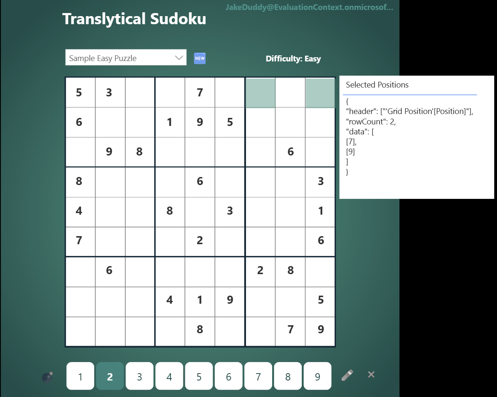

# Handling Multi-Row Inputs for Translytical Task Flows

This post offers a practical guide to passing multiple rows of data from a Power BI report to a User-Defined Function (UDF) using translytical task flows. The solution leverages the `TOJSON()` DAX function to overcome the limitation of scalar-only inputs from slicers.

## Translytical Task Flows

At their core translytical task flows allow buttons within your Power BI reports to trigger a UDF. Within the button definition you map a button, list, or text slicer; a data field; or measures from the report to the input parameters of the UDF. However, a key limitation is that when using a slicer, you can only pass a single (scalar) value. If a user selects multiple items, the button becomes inactive, preventing the UDF from being called. But with a measures, you are able to pass tabular data a string, with the help of the seldomly used DAX function `TOJSON()`.

## Sudoku

This example uses a Sudoku game built with Power BI to demonstrate the solution. The game state is stored in a Fabric SQL database, and UDFs are used to manage game actions.


The game UI consists of several components:

- **Game Selection:** A slicer to select a game template.
- **Game Grid:** A button slicer representing the 81 cells of the Sudoku board. Each button uses a DAX-generated SVG to display numbers and pencil marks.
- **Number Selector:** A button slicer for selecting the number to enter (1-9).
- **Pen/Pencil Buttons:** Buttons that trigger UDFs to enter numbers or pencil marks into the selected cell(s).

The architecture is as follow:


The Pen and Pencil buttons are mapped to the `Position` from the grid button slicer and the `value` from the value selector button slicer. This works perfectly for a single cell selection.


Generally in Sudoku, you want to mark two or more cells simultaneously when entering pencil marks. However when we select more than one cell, the Pen and Pencil buttons becomes inactive:


## Using TOJSON() to Pass Tabular Data

To enable multi-cell input, we need a method to generate a single string that encapsulates information about multiple selected positions. For those familiar with REST APIs, calling the UDF in this context is analogous to a POST request, where the JSON format is the preferred payload.

Fortunately, DAX provides a perfect solution: the built-in `TOJSON()` function. This function generates a JSON string from a given table. We can create a DAX measure that generates a JSON string containing all the selected grid positions.

```dax
Selected Positions = 
IF(
    ISFILTERED( 'Grid Position'[Position] ),
    TOJSON( VALUES( 'Grid Position'[Position] ) )
)
```

This provides the following output:


We can update the mapping from the position provided by the grid button slicer, to the DAX measure:


## Handling the JSON in the UDF

The Python code in the UDF can then parse this string back into a list of positions to be processed.

```python
import fabric.functions as fn
import json
from datetime import datetime

udf = fn.UserDataFunctions()
    
@udf.connection(argName="sqlDB", alias="Game")
@udf.function()
def toggle_pencil_mark(sqlDB: fn.FabricSqlConnection, gameId: int, position: str, pencilValue: int) -> str:
    """
    Toggle a pencil mark in a Sudoku cell
    
    Args:
        gameId: The game ID
        position: JSON string with cell positions
        pencilValue: Pencil mark value (1-9)
        
    Returns:
        JSON string with operation result
    """
    # Parse positions from JSON
    positions_data = json.loads(position)
    positions = [pos[0] for pos in positions_data["data"]]
    
    ## Open connection and SQL database and write values to cells
    conn = sqlDB.connect()
    cursor = conn.cursor()
    
    processed_positions = []
    last_action_type = None
    last_is_active = False
    
    for pos in positions:
        # Skip cells with values
        cursor.execute("SELECT CurrentValue FROM GameState WHERE GameId = ? AND Position = ?", (gameId, pos))
        if cursor.fetchone()[0] is not None:
            continue
        
        # Toggle pencil mark
        cursor.execute("EXEC sp_TogglePencilMark ?, ?, ?", (gameId, pos, pencilValue))
        conn.commit()
        
        # Check if added or removed
        cursor.execute("SELECT IsActive FROM PencilMarks WHERE GameId = ? AND Position = ? AND PencilValue = ?", 
                      (gameId, pos, pencilValue))
        is_active = cursor.fetchone()[0]
        last_action_type = "added" if is_active else "removed"
        last_is_active = is_active
        
        processed_positions.append(pos)
    
    cursor.close()
    conn.close()
    
    return json.dumps({
        "status": "SUCCESS",
        "message": f"Pencil mark {pencilValue} {last_action_type} at position(s) {processed_positions}",
        "game_id": gameId,
        "positions_processed": processed_positions,
        "pencil_value": pencilValue,
        "is_active": last_is_active,
        "action_type": last_action_type,
        "action_time": datetime.now().isoformat()
    })
```

By parsing the JSON string, the UDF can now iterate through the list of positions and perform the required database operations for each one. This allows players to mark multiple cells with the same pencil value simultaneously.



This approach is highly versatile and can be used as a template for any scenario where you need to pass multiple selected items from a Power BI report to a UDF.

Hope this example is useful and sparks some ideas!